# Just Another Claude Markdown File

## Under construction 

### Skills
>Architectural Discovery - Guides you through the process of creating the architecture needed for any app big or small. Will create architectural documentation and optionally fill out templates for you. Finally, it will create a Claude.md for implementating your app

### Installation Instructions
Enable skills in Claude Web or Desktop
Use the official instructions for the most up to date instructions:
https://support.claude.com/en/articles/12512180-using-skills-in-claude

> under settings > capabilities
> enable code and document execution
> navigate to the skills section
> click upload skill
> enable the Architectural Discovery skill

Activate the skill 
>Triggers on "I want to build", "design a system", "architect", "planning a new project", "how should I build X" within the Claude chat

Identifies complexity and scale based on trigger
You can use these triggers if you want to ensure a particular path

| Company Size or Complexity | Triggers |
|----|----|
| small | internal tool, prototype, simple, quick, basic, just need |
| enterprise | HIPAA, PCI, SOC2, platform, multi-team, regulated |

Path by complexity
| Level | Signals | Discovery Depth | Output Size |
|-------|---------|-----------------|-------------|
| **Minimal** | 1-2 devs, ≤2 weeks, no compliance, internal tool | Light | ~50-150 lines |
| **Standard** | 3-6 devs, 1-3 months, basic compliance | Normal | ~200-400 lines |
| **Complex** | 6-12 devs, 3-6 months, compliance, multi-tenant | Deep | ~400-700 lines |
| **Enterprise** | 12+ devs, 6+ months, strict compliance, multi-team | Comprehensive | ~700-1000 lines |

```mermaid
flowchart TB
    P1["🔍 Discovery"] --> DET{{"⚡ Complexity"}}
    DET -->|"minimal"| FAST["⚡ Fast Path"]
    DET -->|"standard+"| S1[["classify-and-expand"]]
    
    S1 --> P2["📝 Refinement"]
    P2 --> P3["🏗️ Architecture"]
    P3 --> S2[["research-and-propose"]]
    S2 --> SEL["⚖️ Selection"]
    SEL --> S3[["generate-artifacts"]]
    S3 --> S4[["validate-and-synthesize"]]
    
    S4 -.->|"optional"| S5[["template-adapter"]]
    S5 -.-> S6[["plan-implementation"]]
    S6 -.-> S7[["validate-plan"]]
    
    S4 --> S8[["generate-claude-md"]]
    S7 -.-> S8
    FAST --> S8
    
    S8 --> S9[["validate-claude-md"]]
    S9 --> OUT(["🚀 CLAUDE.md"])

    classDef phase fill:#6366f1,color:#fff
    classDef subagent fill:#10b981,color:#fff
    classDef decision fill:#f59e0b,color:#fff
    classDef output fill:#ec4899,color:#fff
    classDef fast fill:#0ea5e9,color:#fff
    
    class P1,P2,P3,SEL phase
    class S1,S2,S3,S4,S5,S6,S7,S8,S9 subagent
    class DET decision
    class OUT output
    class FAST fast
```

