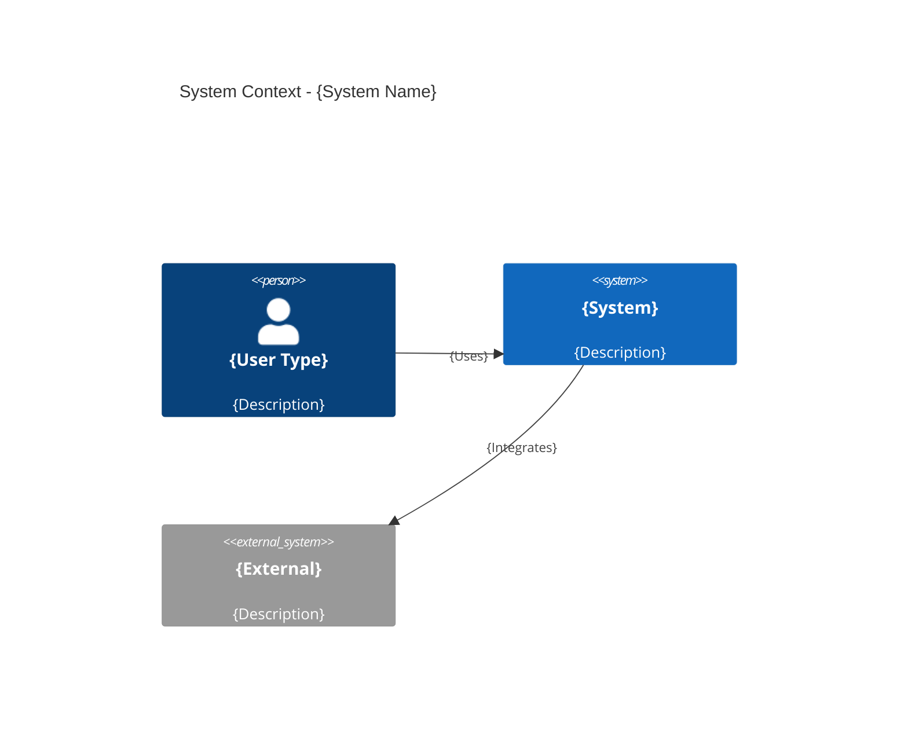
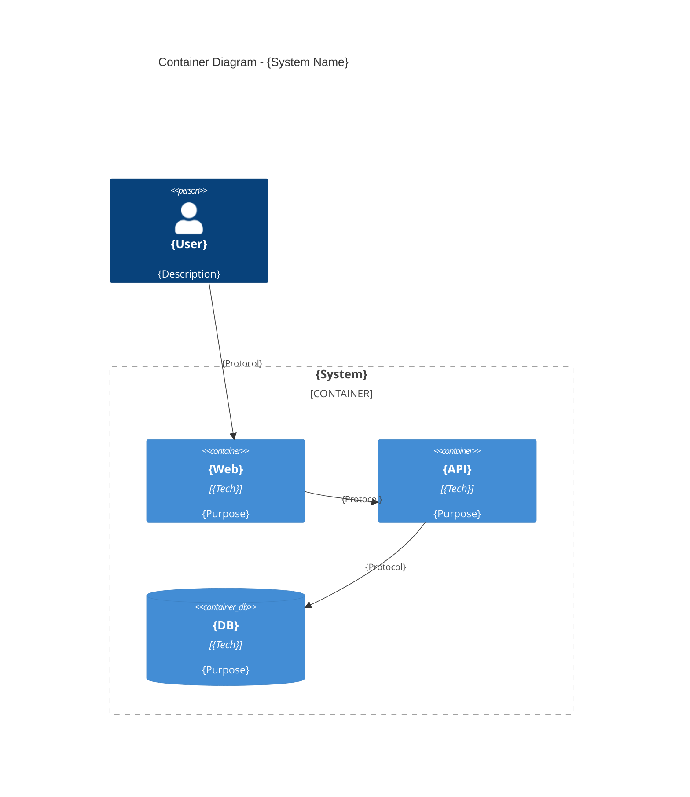
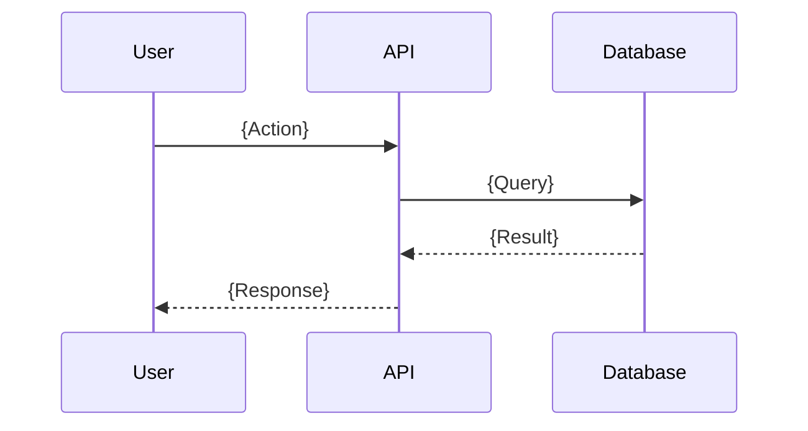

# Output Templates

Standard formats for generated documents.

## ADR Format

```markdown
### ADR-{N}: {Title}

**Status:** Accepted | Proposed | Deprecated | Superseded by ADR-X
**Date:** {Date}

**Context:**
{2-3 sentences on why decision needed}

**Decision:**
{1-2 sentences stating the decision}

**Consequences:**
- ✅ {Positive consequence}
- ⚠️ {Tradeoff accepted}

**Alternatives Considered:**
- {Alternative}: {Why not chosen}

**Revisit If:**
- {Condition that would trigger reconsideration}
```

## C4 Diagram Templates

### Context Diagram


### Container Diagram


### Sequence Diagram


## Tech Stack Table

| Layer | Technology | Version | Cloud Service | Rationale |
|-------|------------|---------|---------------|-----------|
| Frontend | {Tech} | {Ver} | {Service} | {Why} |
| Backend | {Tech} | {Ver} | {Service} | {Why} |
| Database | {Tech} | {Ver} | {Service} | {Why} |
| Cache | {Tech} | {Ver} | {Service} | {Why} |
| Queue | {Tech} | {Ver} | {Service} | {Why} |

## Risk Table

| Risk | L | I | Mitigation | Owner | Status |
|------|---|---|------------|-------|--------|
| {Risk} | H/M/L | H/M/L | {Action} | {Who} | Open |

## Spike Definition

```markdown
# Spike: {Name}

**Priority:** H/M/L
**Effort:** {Estimate}
**Owner:** {Who}
**Status:** Proposed | In Progress | Completed

## Question
{Specific question to answer}

## Why Spike
{Why hands-on validation needed vs more research}

## Approach
1. {Step}
2. {Step}
3. {Measurement}

## Success Criteria
- [ ] {Measurable outcome}

## Decision Framework
**If pass:** {Proceed with X}
**If fail:** {Fallback to Y}

## Results
{What was learned - fill after completion}
```

## Implementation Plan

```markdown
# Implementation Plan: {Project}

**Timeline:** {Start} - {Target}
**Team:** {Size}

## Milestones

### M0: Foundation ({Date})
- [ ] {Deliverable}
- [ ] {Deliverable}

**Exit Criteria:** {Testable condition}

### M1: Core ({Date})
- [ ] {Deliverable}

**Exit Criteria:** {Testable condition}

## Task Breakdown

| Task | Est | Owner | Deps | Status |
|------|-----|-------|------|--------|
| {Task} | {Days} | {Who} | {Deps} | {Status} |

## Build Order
1. Walking skeleton: {Thin slice}
2. High-risk: {Validate early}
3. Core value: {Main feature}
```

## Estimation

```markdown
## Estimate: {Feature}

**Complexity:** Simple | Medium | Complex
**Uncertainty:** Low | Medium | High

| Sub-task | Range | Confidence |
|----------|-------|------------|
| {Task} | {X-Y days} | H/M/L |

**Total:** {Optimistic} - {Likely} - {Pessimistic}

**Risks:** {What could extend this}
```

## Runbook

```markdown
# Runbook: {Operation}

**Owner:** {Team}

## Procedure

### 1. {Step}
```bash
{command}
```
**Expect:** {Output}
**If fail:** {Action}

### 2. {Step}
{Instructions}

## Verify
- [ ] {Check}

## Rollback
{How to undo}

## Troubleshooting

### {Problem}
**Symptom:** {What you see}
**Fix:** {Steps}
```

## Observability

```markdown
## Observability: {System}

### Metrics
| Metric | Target | Alert |
|--------|--------|-------|
| {Metric} | {Target} | {Threshold} |

### Logging
- Format: Structured JSON
- Correlation: request_id
- Retention: {X} days

### Alerts
| Alert | Condition | Severity |
|-------|-----------|----------|
| {Name} | {Condition} | Critical/Warning |
```

## Security Controls

```markdown
## Security: {System}

### Auth
- Method: {OAuth/etc}
- MFA: {Required/Optional}

### AuthZ
- Model: {RBAC/ABAC}
- Roles: {List}

### Data Protection
| Data | At Rest | In Transit |
|------|---------|------------|
| {Type} | {Encryption} | TLS 1.3 |

### Compliance
| Req | Control | Status |
|-----|---------|--------|
| {Req} | {Control} | ✅/❌ |
```

## Stakeholder Map

```markdown
## Stakeholders: {Project}

| Role | Concerns | Success Criteria | Involvement |
|------|----------|------------------|-------------|
| {Role} | {Concerns} | {What they need} | Decision/Consult/Inform |

### Communication Plan
| Audience | Frequency | Format |
|----------|-----------|--------|
| {Who} | {When} | {How} |
```

## Checkpoint (Multi-Session)

```yaml
checkpoint:
  project: "{name}"
  saved_at: "{timestamp}"
  phase: "{completed phase}"
  next: "{next phase}"
  
  summary: |
    {What's been done}
    {Key decisions}
    {What's next}
  
  resume_prompt: |
    Welcome back to {project}!
    Last time: {summary}
    Ready to {next action}?
```
